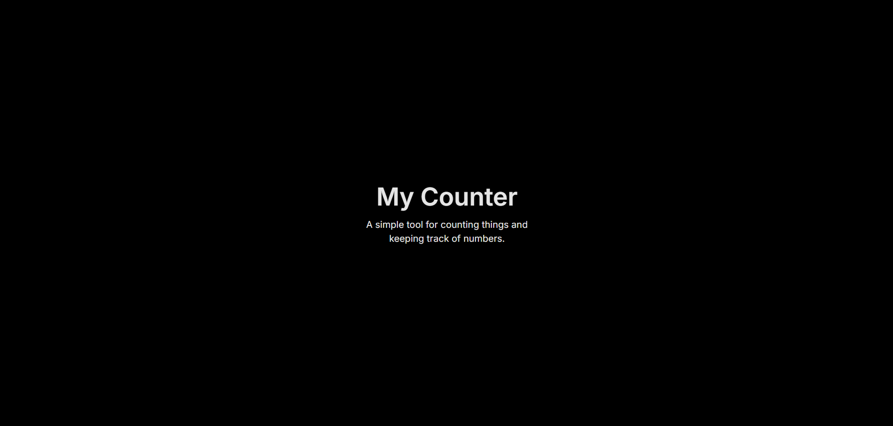

# Minimal Counter App

A clean, minimalist web-based counter inspired by simplecounter.app.

## Features
- Increment and decrement buttons
- Reset functionality
- Saves count using localStorage
- Minimal black and gray UI

## Built With
- HTML
- CSS
- JavaScript

## How To Run
1. Download the project files
2. Open myCounter.html in a browser

## Why I Built This
I built this project to practice frontend fundamentals and replicate a minimalist UI design with precise layout and behavior matching.

## What I Learned
- How to structure a simple web project
- How to use localStorage
- How to replicate a UI design accurately
- The importance of matching behavior before styling

 ##Preview 

